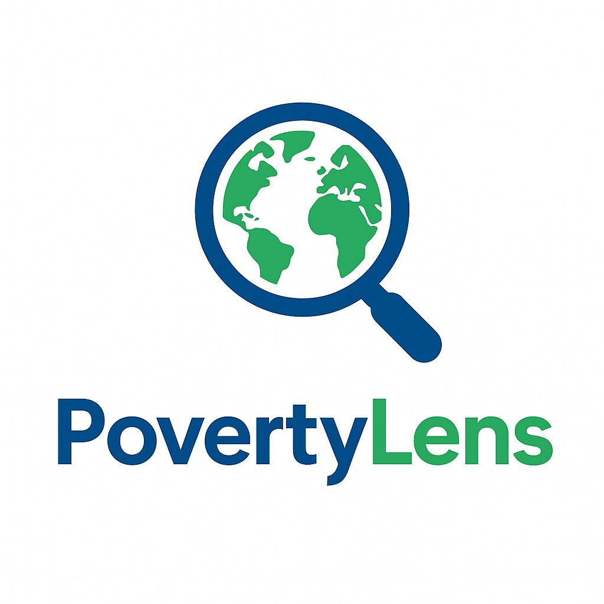
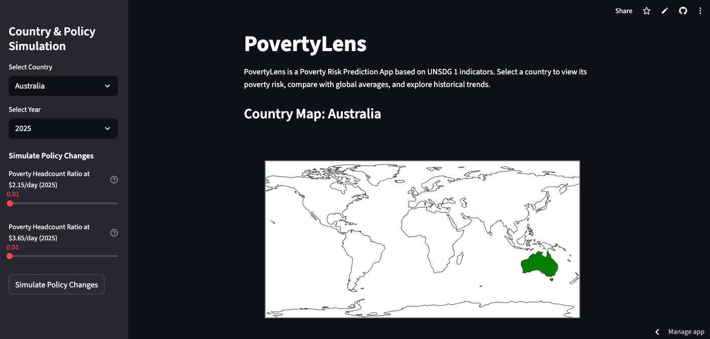

# PovertyLens

<p align="center">
  
</p>

**PovertyLens** is an interactive Streamlit application for analyzing, predicting, and visualizing poverty risk across countries, years, and policy scenarios.  
It leverages UNSDG 1 indicators and machine learning to provide actionable insights for policymakers, researchers, and advocates.

---

## Table of Contents

- [Features](#features)
- [Installation](#installation)
- [Data Requirements](#data-requirements)
- [Usage](#usage)
- [App Structure](#app-structure)
- [Customization](#customization)
- [Screenshots](#screenshots)
- [License](#license)
- [Acknowledgements](#acknowledgements)

---

## Features

- **Country & Year Selection:** Explore poverty indicators and predictions for any country and year in the dataset.
- **User Input Simulation:** Adjust key poverty indicators ($2.15/day and $3.65/day headcount ratios) to simulate policy changes and instantly see updated predictions.
- **Key Poverty Indicators:** View detailed explanations and values for each indicator, including poverty rates after taxes and transfers.
- **Comparative Analysis:** Compare selected country’s indicators against global averages and visualize differences.
- **Historical Trends:** Interactive line charts showing poverty indicator trends from 2000 to 2025.
- **Smart Advice:** Automatically generated, data-driven recommendations tailored to the selected country and scenario.
- **Downloadable Reports:** Export a comprehensive PDF report including predictions, indicators, insights, advice, and all visualizations.
- **Regional Comparison:** Compare countries within the same region or income group (if available in your dataset).
- **Intuitive UI:** Sidebar controls for all selections and simulations, with clear info tooltips and explanations.

---

## Installation

1. **Clone the repository:**
    ```sh
    git clone https://github.com/priscillahandoyo/poverty-lens.git
    cd poverty-lens
    ```

2. **Install dependencies:**
    ```sh
    pip install streamlit pandas joblib matplotlib plotly fpdf
    ```

3. **Prepare your data and model:**
    - Place cleaned CSV files in `data/dataset/`:
        - `cleaned_SDR-2025-poverty-headcount-ratio-at-2-15-day.csv`
        - `cleaned_SDR-2025-poverty-headcount-ratio-at-3-65-day.csv`
        - `cleaned_SDR-2025-poverty-rate-after-taxes-and-transfers.csv`
    - Place your trained model in `models/poverty_risk_model.pkl`.

---

## Data Requirements

Your merged dataset should include:

- `Country`: Country name
- `ISO`: ISO country code (for map visualization)
- `Region` or `Income Group`: For regional comparison (optional but recommended)
- Yearly poverty indicators:
    - `{YEAR}_215`: Poverty headcount ratio at $2.15/day
    - `{YEAR}_365`: Poverty headcount ratio at $3.65/day
    - `{YEAR}`: Poverty rate after taxes and transfers

**Example columns:**  
`Country`, `ISO`, `Region`, `2025_215`, `2025_365`, `2025`, etc.

---

## Usage

1. **Run the app:**
    ```sh
    streamlit run src/app.py
    ```

2. **Interact with the sidebar:**
    - Select a country and year.
    - Adjust poverty indicator sliders to simulate policy changes.
    - Click **Simulate Policy Changes** to update predictions and visualizations.
    - Use the **Reset to Defaults** button to revert sliders to actual data values.
    - Select a region or income group for regional comparison (if available).

3. **Explore the main dashboard:**
    - View map, prediction results, key indicators, comparative bar charts, historical trends, and smart advice.
    - Download a full PDF report with all results and charts.

---

## App Structure

- **Sidebar:**  
  - Country selection  
  - Year selection  
  - Simulation sliders for $2.15/day and $3.65/day indicators  
  - Simulate and reset buttons  
  - Region/income group selection (if available)

- **Main Area:**  
  - Country map visualization  
  - Poverty risk prediction  
  - Key poverty indicators with info tooltips  
  - Country vs global average bar chart  
  - Insights summary  
  - Historical trends line chart  
  - Trend insights  
  - Smart advice section  
  - Regional comparison bar chart  
  - Downloadable PDF report

---

## Customization

- **Add more indicators:**  
  Extend the sidebar and main area to include additional poverty or socioeconomic indicators.
- **Regional/Income Group Comparison:**  
  Ensure your dataset includes `Region` or `Income Group` columns for richer comparative analysis.
- **Advice Logic:**  
  Customize or expand the smart advice section in `src/app.py` for more nuanced recommendations.
- **Report Formatting:**  
  Modify the `create_pdf` function for branding, layout, or additional content.

---

## Screenshots



---

## License

This project is licensed under the MIT License.

---

## Acknowledgements

- United Nations Sustainable Development Goals (UNSDG) datasets
- [Streamlit](https://streamlit.io/)
- [Plotly](https://plotly.com/python/)
- [FPDF](https://pyfpdf.github.io/)
- [scikit-learn](https://scikit-learn.org/)

---

**Created by [Priscilla Handoyo](https://github.com/priscillahandoyo)**